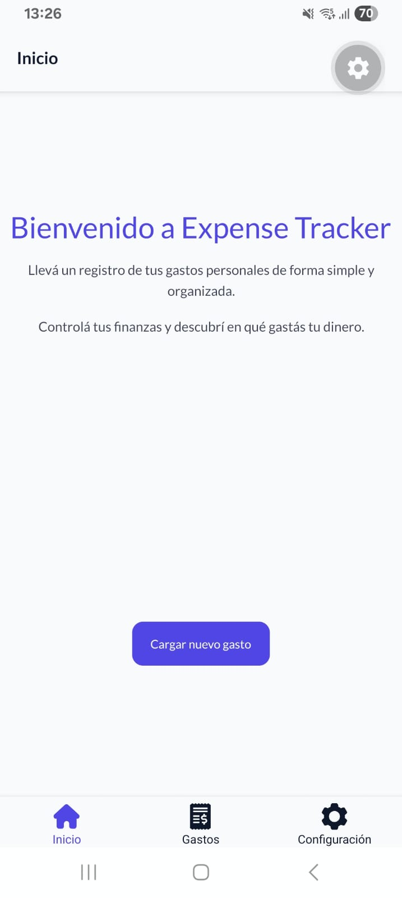
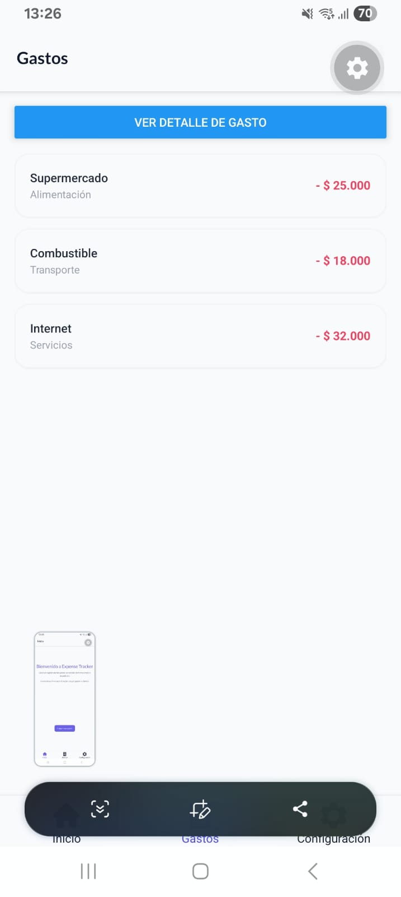
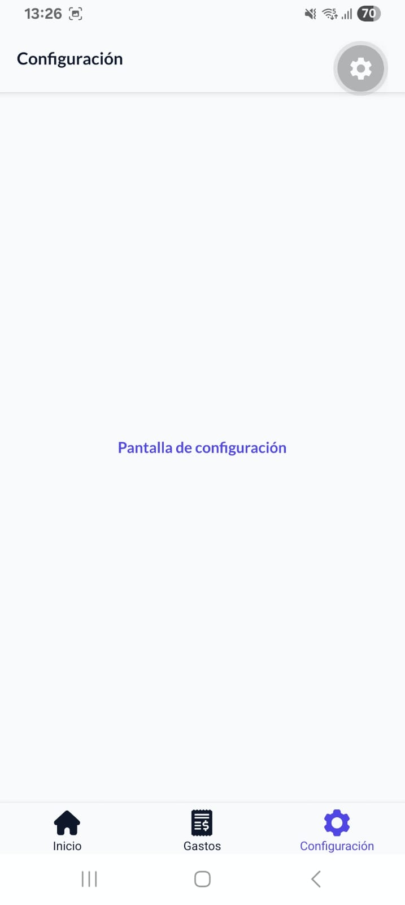
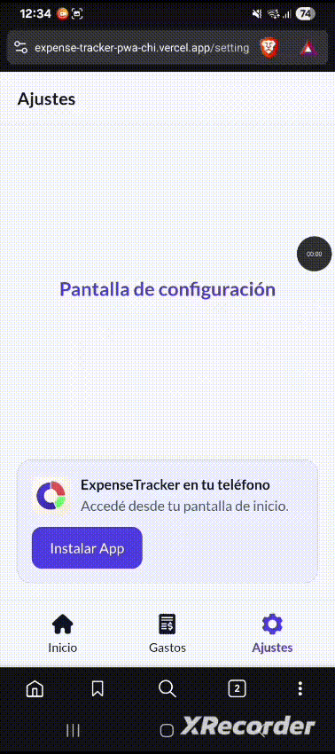
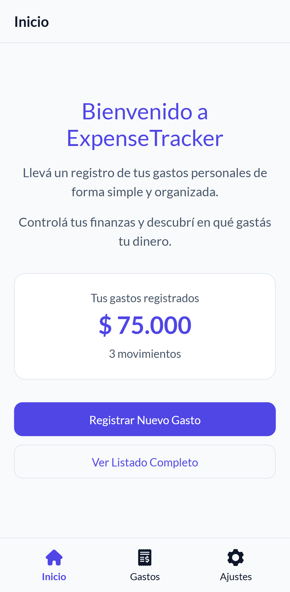
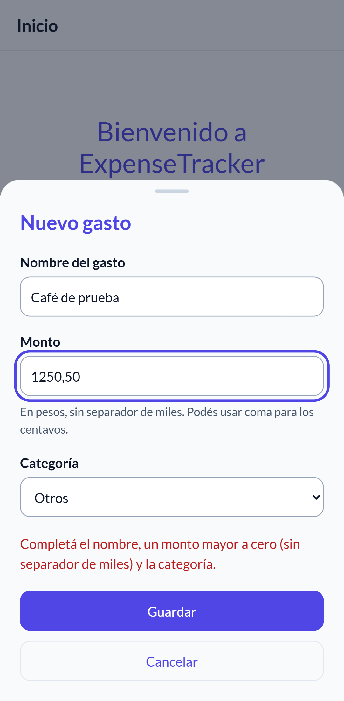

# ExpenseTracker

## Como instalar las dependencias
- pnpm install

## Como ejecutar el proyecto
- pnpx expo start
- Una vez ejecutado el proyecto, podemos probar la aplicación descargando en la playstore ExpoGo.
- Cuando estemos dentro de ExpoGo, en la computadora en la que corrimos la app podemos escanear un QR para probar en vivo los cambios e interactuar con la aplicación, cabe destacar que el teléfono debe estar conectado a la misma red wifi que la computadora que hostea la app.

## Sprint 1: App móvil con React Native y Expo

### Manejo de navegación
- Se implementó el tab navigator con 3 tabs (Inicio, Gastos, Configuración).
- Demo de `NavigationContainer` con los `TabScreens`, `StackNavigator` y Bottom Navigation Bar.

#### Pantalla de inicio, gastos y configuración como TabScreens

| Inicio | Gastos | Configuración |
| --- | --- | --- |
|  |  |  |

#### Demostración de StackNavigator y Navegación Anidada
- Se integró el `StackNavigator` junto con el `TabNavigator` para permitir navegación fluida entre pantallas y apertura de modales.
- Permite acceder al detalle de un gasto puntual y abrir la pantalla modal para registrar nuevos gastos.

---

## Sprint 2: Progressive Web App (PWA)

Versión web desarrollada con React + Vite en [`expense-tracker-pwa/`](./expense-tracker-pwa) ([ver documentación completa de la PWA](./expense-tracker-pwa/README.md)).

- **URL pública (HTTPS):** https://expense-tracker-pwa-chi.vercel.app/
- **Instalación y Service Worker:** `manifest.json` configurado para modo `standalone`, precache offline con `vite-plugin-pwa` (Workbox) y reglas SPA en Vercel/Netlify.
- **Lighthouse Mobile:** 100 Performance · 100 Accessibility · 100 Best Practices · 100 SEO ([ver captura](./expense-tracker-pwa/docs/lighthouse-mobile.png)).

### Demo instalada en teléfono (`standalone`)

### Comparativa visual: React Native vs PWA
| Pantalla | React Native (Expo Go) | PWA (React + Vite) |
| --- | --- | --- |
| Inicio |  |  |
| Listado de gastos |  |  |
| Nuevo gasto (modal) | — |  |

### Tabla comparativa: React Native vs PWA
| Aspecto | React Native (Expo) | PWA (React + Vite) |
| --- | --- | --- |
| **Distribución e instalación** | Requiere Expo Go en desarrollo o compilación (`.apk`/`.ipa`) para tiendas. | Se distribuye por URL HTTPS y se instala desde el navegador con `manifest.json`. |
| **Navegación** | React Navigation (`TabNavigator` + `StackNavigator` con `presentation: 'modal'`). | React Router (`MainLayout` con `<Outlet>` + `<NavLink>`) y `<dialog>` con `createPortal` para modales. |
| **Estilos y layout** | `StyleSheet` / NativeWind (`View`, `Text`, `Pressable`) y `SafeAreaView`. | HTML semántico (`header`, `main`, `section`), CSS estándar con Flexbox, `100dvh` y `env(safe-area-inset-*)`. |
| **Modo offline** | El bundle JS corre local en el dispositivo de forma nativa. | Service Worker (`vite-plugin-pwa` + Workbox) pre-cachea HTML, CSS, JS, fuentes e íconos. |
| **Deep linking y URL** | Navegación por nombres de ruta y parámetros en memoria (`route.params`). | La URL es la fuente de verdad (`/expenses/:id` con `useParams()`), recargable con rewrites SPA. |
| **Experiencia en iOS/Android** | Comportamiento nativo uniforme en ambas plataformas. | En Android soporta `beforeinstallprompt`; en iOS requiere instalación manual desde Safari (*Agregar a inicio*). |

---

## Sprint 3: Persistencia y sincronización

### US #1 (`per-s3-us1`): Centralización de gastos con Context API

- **¿Por qué usamos un Context (`ExpensesContext`)?**
  Inicio, Listado, Detalle y el Formulario necesitan leer y modificar la **misma lista de gastos**. Si cada pantalla tuviera su propio `useState`, los datos quedarían desincronizados; si pasáramos props por cada nivel (*prop drilling*), acoplaríamos toda la navegación. Con `ExpensesContext` + el custom hook `useExpenses()`, cualquier pantalla accede al estado compartido sin importar dónde esté en el árbol.
- **Desacoplamiento (fuente única de verdad):**
  Las pantallas **no saben** de dónde salen ni dónde se guardan los datos (memoria hoy, `AsyncStorage` / `localStorage` mañana, Cloud Firestore después). Solo consumen `{ expenses, isLoaded, addExpense, removeExpense }` desde `useExpenses()`. Cuando cambiemos el almacenamiento en las próximas US, **las pantallas no se tocan**: solo cambia el `ExpensesProvider`.
- **Dónde se monta el Provider:**
  En la raíz de cada app (`App.tsx` envolviendo `NavigationContainer` en React Native; `main.jsx` envolviendo `BrowserRouter` en la PWA) para que todas las rutas compartan la misma instancia del estado.
- **Modelo de datos unificado y `CATEGORIES`:**
  Ambas versiones usan exactamente la misma estructura (`id`, `title`, `amount` como número, `category`, `notes`, `createdAt` en ISO) para poder compartir luego la colección en Firestore. Los colores y metadatos visuales de categorías no se guardan en los gastos: se resuelven desde `src/data/categories`.
- **Estado actual (Etapa 1 — Volátil):**
  En esta US los gastos todavía viven en `useState` dentro del `ExpensesProvider` (memoria RAM). La bandera `isLoaded` ya está expuesta en el contrato del Context para el patrón de hidratación que llega con `AsyncStorage` y `localStorage`.